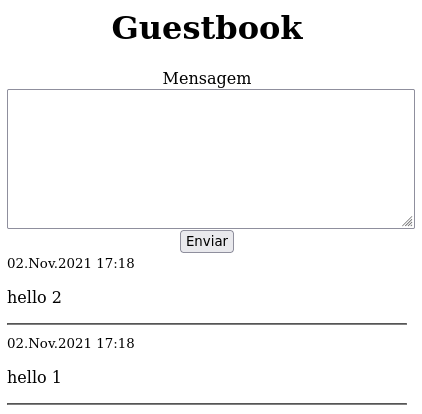

# Desafio do PHP x Ruby

Fazer um "guestbook" que rode no browser grave as mensagens em um arquivo "txt"

## No Github
- [Versão em Go](https://github.com/VitorEstevam/guestbook) por [@VitorEstevam](https://github.com/VitorEstevam)
- [Versão em Ruby](https://github.com/leandronsp/guestbook) por [@leandronsp](https://github.com/leandronsp/)

## No Twitter
- [Início da discussão](https://twitter.com/leandronsp/status/1455598643927556104)
- [Parte final da discussão](https://twitter.com/leandronsp/status/1455711853619916802)
- [Surge a versão em Go](https://twitter.com/vitorstvm/status/1459756340906270723)

## Tela

<div align="center">



</div>

## Configuração

```
sudo chmod 777 messages.txt
```

## Execução via socket
```
php server.php
```

## Execução via servidor built-in

```
php -S localhost:8000
```
