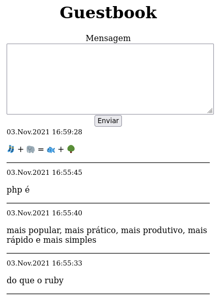

# Guest

Desafio do PHP x Ruby

- [Início da discussão](https://twitter.com/leandronsp/status/1455598643927556104)
- [Parte final da discussão](https://twitter.com/leandronsp/status/1455711853619916802)

## Tela

<div align="center">



</div>

## Configuração

```
sudo chmod 777 messages.txt
```

## Execução via socket
```
php server.php
```

## Execução via servidor built-int

```
php -S localhost:8000
```
